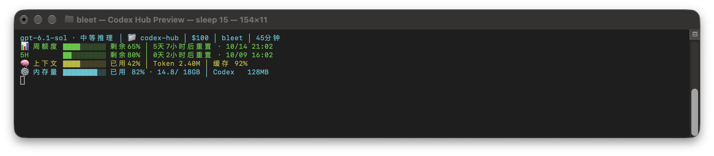

# Codex Hub

**把 Codex 的上下文、额度和内存留在终端底部。**

一个本地、轻量的 Codex CLI 状态栏：Python 标准库 + tmux，不修改官方 Codex 二进制。运行 `codex` 就出现，退出 Codex 或关闭窗口就停止。



> 图片使用 `scripts/demo.py` 的合成数据。模型、项目、额度和内存都只是效果示例，不代表真实账号或账单。

## 它长什么样

```text
gpt-6.1-sol · 中等推理 │ 📁 codex-hub │ $100 │ Mac │ 45分钟
📊 周额度 ████░░░░░░ 剩余65% │ 5天7小时后重置 · 10/14 20:00
5H       ██░░░░░░░░ 剩余80% │ 0天2小时后重置 · 10/09 15:00
🧠 上下文 ████░░░░░░ 已用42% │ Token 2.40M │ 缓存 92%
⚙️  内存量 ████████░░ 已用 82% · 14.8/ 18GB │ Codex   128MB
```

没有 `5H` 数据时整行隐藏，通常是四行；有数据时为五行。周额度、上下文和内存的三条进度条从同一列开始。内存行的百分比、GB、MB 数字使用固定宽度，数值变化不移动后面的字段。进度条表示**已用比例**，周额度旁的文字表示**剩余比例**。

窗口窄于 64 列时，三条进度条统一缩短为四格，始终保留。很窄的窗口会截断右侧文字，建议至少 80 列，完整显示推荐 100～120 列。

## 功能

- 模型、推理强度、当前项目文件夹、订阅标签和会话时长。
- 周额度与可选 `5H` 额度：剩余百分比、重置倒计时和本地时间。
- 最近一次上下文占用、累计 Token、输入缓存命中比例、当前工具名。
- 整机内存近似用量，以及当前 Codex 进程树的 RSS。
- 同一进程恢复的旧会话、`CODEX_HOME` 隔离目录、日志截断和替换恢复。
- 变化行重画、增量读取；内存和额度每五秒检查。
- HUD 钩子或采样失败时降级，不中断聊天；tmux 不可用时启动原生 Codex。

## 环境

- **macOS**，Python 3.9+，tmux，zsh 或 bash。
- 已安装并登录的 [官方 Codex CLI](https://github.com/openai/codex)。当前验证版本为 0.162.0。
- HUD 本身没有 pip/npm 依赖，无需模型 API Key。Linux 的基础显示可尝试，但内存采样目前使用 macOS 命令，Linux 和 Windows 尚未完整验证。

macOS 缺少依赖时，可使用 Homebrew：

```bash
brew install python tmux
brew install --cask codex
codex login
```

## 安装：三步完成

```bash
git clone https://github.com/bleeeet/codex-hub.git
cd codex-hub
python3 scripts/install.py
```

安装器会：

1. 将四个运行文件安装到 `~/.codex/scripts/`。
2. 在 `.zshrc` 或 `.bashrc` 加入 HUD 入口。
3. 合并 Codex `hooks.json` 的 SessionStart 钩子，并启用 `[features].hooks`。

其他 shell 配置、钩子和 Codex 设置会保留。安装可重复执行，不会重复添加入口。

打开新终端，然后正常运行：

```bash
codex
```

当前窗口也可以 `source ~/.zshrc`，bash 用 `source ~/.bashrc`。`codex exec`、登录、插件管理等非交互命令仍运行原生 Codex。

无需安装，也能先试启动：

```bash
python3 scripts/bleet-hud.py launch
```

## 配置与日常使用

| 需求 | 方法 |
|---|---|
| 本次不显示 HUD | `BLEET_HUD=0 codex` |
| 模型与推理强度 | 按 Codex 自身配置或交互命令修改，HUD 读取会话实际值 |
| 项目名 | 从会话 `cwd` 自动取最后一级文件夹名 |
| 隔离账号或配置目录 | `CODEX_HOME=/path/to/profile codex`；该目录需已有对应登录与配置 |
| 预览四行 | `python3 scripts/demo.py` |
| 预览五行 | `python3 scripts/demo.py --five-hour` |
| 预览窄窗口 | `python3 scripts/demo.py --narrow` |
| 重载已运行底栏 | `python3 scripts/reload-hud.py`，只重启 HUD，不重启聊天 |
| 修改标签、图标、金额映射 | 编辑 `scripts/bleet-hud.py` 的 `render()`，再运行安装器和重载脚本 |

订阅金额是本项目的可读预设：`prolite → $100`、`pro → $200`、`plus → $19`、`go → $8`。它们**不是实时官方定价，也不是本次调用费用**；未知套餐不猜金额。请按自己的订阅修改映射。

使用自定义 `CODEX_HOME` 时，先在同一环境运行安装器，确保该目录也有 HUD 钩子：

```bash
CODEX_HOME=/path/to/profile python3 scripts/install.py
CODEX_HOME=/path/to/profile codex
```

## 更新与卸载

普通用户更新：

```bash
git pull --ff-only
python3 scripts/install.py
python3 scripts/reload-hud.py
```

卸载本次安装：

```bash
python3 scripts/install.py --uninstall
```

卸载移除 HUD 自己的入口、钩子和运行文件，不删除账号、会话日志或其他配置。已打开的聊天不强行关闭，当前 HUD 会在所属会话结束时退出。自定义目录的钩子需使用相同 `CODEX_HOME` 卸载。

**维护者自动更新：** 本项目维护者在 Codex 中修改 HUD 后，已有 Stop 前台同步会合并本机安装副本与项目源码，运行检查并提交到此仓库。没有文件监听、定时轮询、LaunchAgent 或开机自启。其他使用者更新仍使用上面的命令，不会自动执行远端新代码。

## 数据来源和边界

- 读取当前 Codex home 的本地会话 JSONL；`auth.json` 中的账号 ID 仅用于隔离额度快照，程序不发送凭据。
- 恢复旧会话时，只读日志 SQLite 中的所属 PID/直接子进程映射；找不到可靠归属时保持等待，不借最近窗口的数据。
- 不上传数据，不另存聊天副本，不启动独立常驻服务；仅随交互式 Codex 会话运行。
- 上下文占用是最近一次 Token 数与窗口大小的近似比值；累计 Token 单独显示，不把累计数当作上下文。
- 额度来自同账号日志中的最近快照，空闲时可能滞后；缺失数据不伪造，已过期快照撤下。
- 内存占用百分比不是 macOS 内存压力；Codex RSS 求和可能包含重复的共享页。
- Codex 日志与 SQLite 不是承诺稳定的插件接口；Codex 升级后显示异常，需要适配。

## 常见问题

**为什么没有 5H？** 当前日志未提供这一窗口，整行隐藏；并非自动认为额度用完。

**为什么一直等待数据？** 确认 `CODEX_HOME` 对应当前会话，日志仍存在，SessionStart hooks 已启用。恢复旧会话时若没有进程映射或精确钩子，HUD 会保守等待。

**滚轮会影响聊天吗？** HUD 面板禁用滚轮。聊天区滚动由 tmux 处理；备用屏幕中的旧会话使用翻页键。

**窗口关闭后会残留吗？** 专用 tmux 会话设置了 `destroy-unattached`；不以 detach 保留会话。已有 tmux 环境的关闭语义取决于原来的 tmux 会话。

## 开发与检查

```bash
python3 -m unittest discover -s scripts/tests -p 'test_*.py'
```

覆盖：会话隔离、增量读取、半行恢复、日志替换/截断、额度缓存、旧会话绑定、故障降级、三条进度条对齐、4/5 行实际 tmux 切换，以及安装/卸载时保留其他配置。测试会创建临时 tmux 会话，结束时清理。

```text
scripts/
  bleet-hud.py             HUD 主程序
  bleet-hud.tmux.conf      滚轮与历史配置
  hud-shell.zsh           Codex 交互入口
  install.py              安装与卸载
  reload-hud.py           一次性重载面板
  demo.py                 合成数据效果预览
  tests/                  测试
docs/assets/              README 效果图
```

## 致谢与许可

布局思路参考 Codex/Claude 的终端 HUD；稳定性设计参考 [konnga/codex-hud](https://github.com/konnga/codex-hud) 的会话绑定、增量读取和降级方式。本项目为独立 Python 实现，没有复制其 TypeScript 源码。

MIT License。与 OpenAI 无官方关联。
